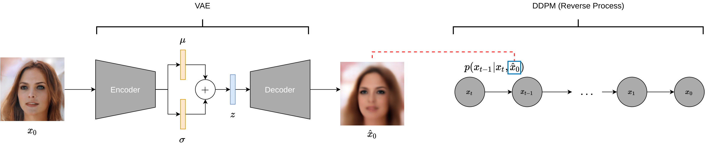

# DiffuseVAE: Efficient, Controllable and High-Fidelity Generation from Low-Dimensional Latents

This repo contains the official implementation of the paper: [DiffuseVAE: Efficient, Controllable and High-Fidelity Generation from Low-Dimensional Latents](https://arxiv.org/abs/2201.00308) by [Kushagra Pandey](https://kpandey008.github.io/), [Avideep Mukherjee](https://www.cse.iitk.ac.in/users/avideep/), [Piyush Rai](https://www.cse.iitk.ac.in/users/piyush/), [Abhishek Kumar](http://www.abhishek.umiacs.io/)

---
## Overview

 DiffuseVAE is a novel generative framework that integrates a standard VAE within a diffusion model by conditioning the diffusion model samples on the VAE generated reconstructions. The resulting model can significantly improve upon the blurry samples generated from a standard VAE while at the same time equipping diffusion models with the low-dimensional VAE inferred latent code which can be used for downstream tasks like controllable synthesis and image attribute manipulation. In short, DiffuseVAE presents a generative model which combines the benefits of both VAEs and Diffusion models.



Our core contributions are as follows:

1. We propose a generic DiffuseVAE conditioning framework and show that our framework can be reduced to a simple *generator-refiner* framework in which blurry samples generated from a VAE are refined using a conditional DDPM formulation.

1. **Controllable synthesis** from a low-dimensional latent using diffusion models.

1. **Sampling speedups**: We show that DiffuseVAE inherently requires fewer reverse diffusion sampling steps during inference compared to the unconditional DDPM model. Furthermore we also present a DiffuseVAE formulation conditioned on continuous noise as proposed in WaveGrad and show that we can generate plausible image samples in as few as **10** reverse sampling steps.

1. **State-of-the-art synthesis**:  DiffuseVAE achieves a FID score of **8.72** on CIFAR-10 and **4.76** on CelebA-64, thus outperforming (Hierarchical) VAE-based methods.

1. **Generalization to Downstream tasks**: DiffuseVAE exhibits out-of-the-box generalization to downstream tasks like image super-resolution and denoising.


---

## Code overview

This repo uses [PyTorch Lightning](https://www.pytorchlightning.ai/) for training and [Hydra](https://hydra.cc/docs/intro/) for config management so basic familiarity with both these tools is expected. Please clone the repo with `DiffuseVAE` as the working directory for any downstream tasks like setting up the dependencies, training and inference.

## Setting up the dependencies

We use `pipenv` for a project-level dependency management. Simply [install](https://pipenv.pypa.io/en/latest/#install-pipenv-today) `pipenv` and run the following command:

```
pipenv install
```

## Training

A sample command to train DiffuseVAE is as follows:
```
python main/train_ddpm.py +dataset=celeba64/train \
                     dataset.ddpm.data.root='/path/to/celeba64/reconstructions/dir/' \
                     dataset.ddpm.data.name='recons' \
                     dataset.ddpm.data.hflip=True \
                     dataset.ddpm.data.norm=True \
                     dataset.ddpm.training.type='form1' \
                     dataset.ddpm.training.batch_size=32 \
                     dataset.ddpm.training.device=\'gpu:1\' \
                     dataset.ddpm.training.results_dir=\'/data1/kushagrap20/celeba64_10thJan_form1\' \
                     dataset.ddpm.training.workers=2 \
                     dataset.ddpm.training.chkpt_prefix='celeba64_10thJan_form1'
```
For training the noise-conditioned version of DiffuseVAE, simply switch to the `vaedm-noise-cond` branch using `git checkout vaedm-noise-cond` and run the same command as above.

## Inference

A sample command to perform sample generation using a pretrained DiffuseVAE model is as follows:
```
python main/eval/ddpm/sample_cond.py +dataset=celebamaskhq128/test \
                        dataset.ddpm.data.norm=True \
                        dataset.ddpm.evaluation.seed=0 \
                        dataset.ddpm.evaluation.sample_prefix='gpu_0' \
                        dataset.ddpm.evaluation.device=\'gpu:0\' \
                        dataset.ddpm.evaluation.chkpt_path=\'/path/to/pretrained/ddpm/checkpoint.pt\' \
                        dataset.ddpm.evaluation.type='form1' \
                        dataset.ddpm.evaluation.temp=1.0 \
                        dataset.ddpm.evaluation.batch_size=64 \
                        dataset.ddpm.evaluation.save_path=\'/path/where/to/save/samples/\' \
                        dataset.ddpm.evaluation.n_samples=4 \
                        dataset.ddpm.evaluation.n_steps=1000 \
                        dataset.ddpm.evaluation.save_vae=True \
                        dataset.ddpm.evaluation.workers=1 \
                        dataset.vae.evaluation.chkpt_path=\'/path/to/pretrained/vae/checkpoint.pt\'
```
For sample generation from the noise-conditioned version of DiffuseVAE, simply switch to the `vaedm-noise-cond` branch using `git checkout vaedm-noise-cond` and run the following command.

```
python main/eval/ddpm/sample_cond.py +dataset=celebamaskhq128/test \
                        dataset.ddpm.data.norm=True \
                        dataset.ddpm.model.beta1=1e-6 \
                        dataset.ddpm.model.beta2=0.6 \
                        dataset.ddpm.model.n_timesteps=10 \
                        dataset.ddpm.evaluation.seed=0 \
                        dataset.ddpm.evaluation.sample_prefix='gpu_1' \
                        dataset.ddpm.evaluation.device=\'gpu:0,1\' \
                        dataset.ddpm.evaluation.chkpt_path=\'/path/to/pretrained/ddpm/checkpoint.pt\' \
                        dataset.ddpm.evaluation.type='form1' \
                        dataset.ddpm.evaluation.temp=1.0 \
                        dataset.ddpm.evaluation.batch_size=16 \
                        dataset.ddpm.evaluation.save_path=\'/path/where/to/save/samples/\' \
                        dataset.ddpm.evaluation.n_samples=64 \
                        dataset.ddpm.evaluation.n_steps=10 \
                        dataset.ddpm.evaluation.save_vae=True \
                        dataset.ddpm.evaluation.workers=1 \
                        dataset.ddpm.evaluation.persistent_buffers=False \
                        dataset.vae.evaluation.chkpt_path=\'/path/to/pretrained/vae/checkpoint.pt\'
```

## Pretrained checkpoints
**NOTE**: We are currently organizing all pretrained checkpoints and will add the links to download the checkpoints soon.

## Citing
To cite DiffuseVAE please use the following BibTEX entries:

```
@misc{pandey2022diffusevae,
      title={DiffuseVAE: Efficient, Controllable and High-Fidelity Generation from Low-Dimensional Latents}, 
      author={Kushagra Pandey and Avideep Mukherjee and Piyush Rai and Abhishek Kumar},
      year={2022},
      eprint={2201.00308},
      archivePrefix={arXiv},
      primaryClass={cs.LG}
}
```
```
@inproceedings{
pandey2021vaes,
title={{VAE}s meet Diffusion Models: Efficient and High-Fidelity Generation},
author={Kushagra Pandey and Avideep Mukherjee and Piyush Rai and Abhishek Kumar},
booktitle={NeurIPS 2021 Workshop on Deep Generative Models and Downstream Applications},
year={2021},
url={https://openreview.net/forum?id=-J8dM4ed_92}
}
```

Since our model uses diffusion models please consider citing the original [Diffusion model](https://arxiv.org/abs/1503.03585), [DDPM](https://arxiv.org/abs/2006.11239) and [VAE](https://arxiv.org/abs/1312.6114) papers.

## Contact
Kushagra Pandey (@kpandey008)