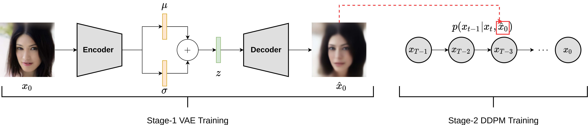

# DiffuseVAE: Efficient, Controllable and High-Fidelity Generation from Low-Dimensional Latents

This repo contains the official implementation of the paper: [DiffuseVAE: Efficient, Controllable and High-Fidelity Generation from Low-Dimensional Latents](https://arxiv.org/abs/2201.00308) by [Kushagra Pandey](https://kpandey008.github.io/), [Avideep Mukherjee](https://www.cse.iitk.ac.in/users/avideep/), [Piyush Rai](https://www.cse.iitk.ac.in/users/piyush/), [Abhishek Kumar](http://www.abhishek.umiacs.io/)

---
## Overview

 DiffuseVAE is a novel generative framework that integrates a standard VAE within a diffusion model by conditioning the diffusion model samples on the VAE generated reconstructions. The resulting model can significantly improve upon the blurry samples generated from a standard VAE while at the same time equipping diffusion models with the low-dimensional VAE inferred latent code which can be used for downstream tasks like controllable synthesis and image attribute manipulation. In short, DiffuseVAE presents a generative model which combines the benefits of both VAEs and Diffusion models.



Our core contributions are as follows:

1. We propose a generic DiffuseVAE conditioning framework and show that our framework can be reduced to a simple *generator-refiner* framework in which blurry samples generated from a VAE are refined using a conditional DDPM formulation.

1. **Controllable synthesis** from a low-dimensional latent using diffusion models.

1. **Better speed vs quality tradeoffs**: We show that DiffuseVAE inherently provides a better speed vs quality tradeoff as compared to standard DDPM/DDIM models on several image benchmarks

1. **State-of-the-art synthesis**:  We show that DiffuseVAE exhibits synthesis quality comparable to recent state-of-the-art on standard image synthesis benchmarks like CIFAR-10, CelebA-64 and CelebA-HQ while maintaining access to a low-dimensional latent code representation.

1. **Generalization to noisy conditioning signals**: We show that a pre-trained DiffuseVAE model exhibits generalization to different noise types in the DDPM conditioning signal exhibiting the effectiveness of our conditioning framework.


---

## Code overview

This repo uses [PyTorch Lightning](https://www.pytorchlightning.ai/) for training and [Hydra](https://hydra.cc/docs/intro/) for config management so basic familiarity with both these tools is expected. Please clone the repo with `DiffuseVAE` as the working directory for any downstream tasks like setting up the dependencies, training and inference.

## Setting up the dependencies

We use `pipenv` for a project-level dependency management. Simply [install](https://pipenv.pypa.io/en/latest/#install-pipenv-today) `pipenv` and run the following command:

```
pipenv install
```

## Config Management
We manage `train` and `test` configurations separately for each benchmark/dataset used in this work. All configs are present in the `main/configs` directory. This directory has subfolders named according to the dataset. Each dataset subfolder contains the training and evaluation configs as `train.yaml` and `test.yaml`. 

**Note**: The configuration files consists of many command line options. The meaning of each of these options is explained in the config for CIFAR-10.

## Training
Please refer to the scripts provided in the table corresponding to some training tasks possible using the code.

|          **Task**          	|      **Reference**      	|
|:--------------------------:	|:-----------------------:	|
|  Training First stage VAE  	|  `scripts/train_ae.sh`  	|
| Training Second stage DDPM 	| `scripts/train_ddpm.sh` 	|

## Inference

Please refer to the scripts provided in the table corresponding to some inference tasks possible using the code.

|                          **Task**                         	|         **Reference**         	|
|:---------------------------------------------------------:	|:-----------------------------:	|
|            Sample/Reconstruct from Baseline VAE           	|      `scripts/test_ae.sh`     	|
|                   Sample from DiffuseVAE                  	|     `scripts/test_ddpm.sh`    	|
|          Generate reconstructions from DiffuseVAE         	| `scripts/test_recons_ddpm.sh` 	|
| Interpolate in the VAE/DDPM latent space using DiffuseVAE 	|    `scripts/interpolate.sh`   	|

For computing the evaluation metrics (FID, IS etc.), we use the [torch-fidelity](https://github.com/toshas/torch-fidelity) package. See `scripts/fid.sh` for some sample usage examples.


## Pretrained checkpoints
All pretrained checkpoints have been organized by dataset and can be accessed [here](https://drive.google.com/drive/folders/1GzIh75NnpgPa4A1hSb_viPowuaSHnL7R?usp=sharing).

## Citing
To cite DiffuseVAE please use the following BibTEX entries:

```
@misc{pandey2022diffusevae,
      title={DiffuseVAE: Efficient, Controllable and High-Fidelity Generation from Low-Dimensional Latents}, 
      author={Kushagra Pandey and Avideep Mukherjee and Piyush Rai and Abhishek Kumar},
      year={2022},
      eprint={2201.00308},
      archivePrefix={arXiv},
      primaryClass={cs.LG}
}
```
```
@inproceedings{
pandey2021vaes,
title={{VAE}s meet Diffusion Models: Efficient and High-Fidelity Generation},
author={Kushagra Pandey and Avideep Mukherjee and Piyush Rai and Abhishek Kumar},
booktitle={NeurIPS 2021 Workshop on Deep Generative Models and Downstream Applications},
year={2021},
url={https://openreview.net/forum?id=-J8dM4ed_92}
}
```

Since our model uses diffusion models please consider citing the original [Diffusion model](https://arxiv.org/abs/1503.03585), [DDPM](https://arxiv.org/abs/2006.11239) and [VAE](https://arxiv.org/abs/1312.6114) papers.

## Contact
Kushagra Pandey (@kpandey008)
